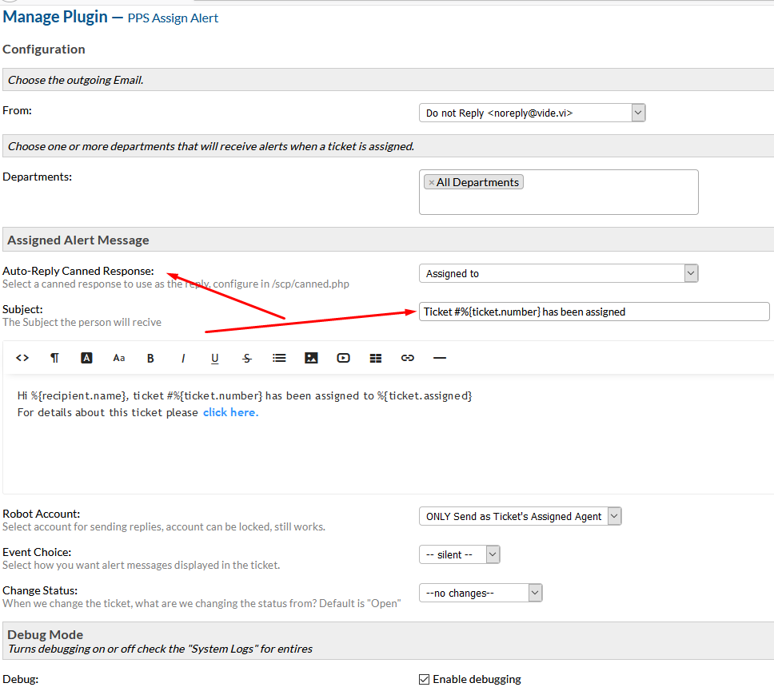

# osTicket-alert-plugin 

==============

This plugin sends alerts to users when an agent or system assigns a ticket to another agent or claims a ticket (works with filters).

Info
------
This plugin was designed/tested with osTicket-1.10.1 to 1.14.3
Still in beta and has garbage code its works for me and I need others to test and let me know what updates it may need.

What this plugin does is quite simple.
Every time an Agent assigns a ticket a message is sent to the user.
It updates the ticket either by note or message (can be the assigned agent or another account)
Can change the ticket status
Send custom message to User and fully supports osticket variables.
Ability to chose what Departments that will trigger an alert.

## Configuration
Create a custom Canned Response for that the system will send to the user
Add the custom subject

## Install
--------
0. Clone this repo or download the zip file and place the contents into your `include/plugins` folder.
0. Now the plugin needs to be enabled & configured, so login to osTicket, select "Admin Panel" then "Manage -> Plugins" you should be seeing the list of currently installed plugins.
0. Click on `PPS Assign Alert` and configure your settings. 
0. Click `Save Changes`!. 
0. After that, go back to the list of plugins and tick the checkbox next to "PPS Assign Alert" and select the "Enable" button.
